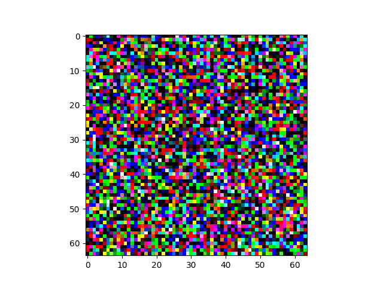
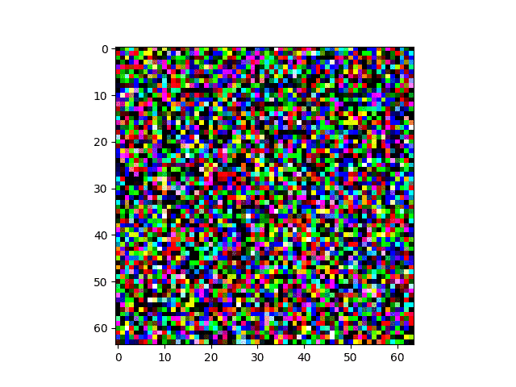
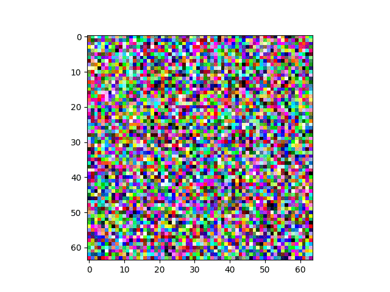

# Diffusion
Learn Diffusion

## DDIM - Denoising Diffusion Implicit Models
- [DDIM](https://arxiv.org/abs/2105.05233) 
- https://keras.io/examples/generative/ddim/

<table>
  <tr>
    <td></td>
    <td></td>
  </tr>
</table>

## DDPM - Diffusion Probabilistic Models
- [DDPM](https://arxiv.org/abs/2105.05233) 
- https://keras.io/examples/generative/ddpm/

<table>
  <tr>
    <td></td>
  </tr>
</table>

## Stable Diffustion - exploring latent space 
- https://keras.io/examples/generative/random_walks_with_stable_diffusion/

<table>
  <tr>
    <td></td>
    <td></td>
  </tr>
</table>